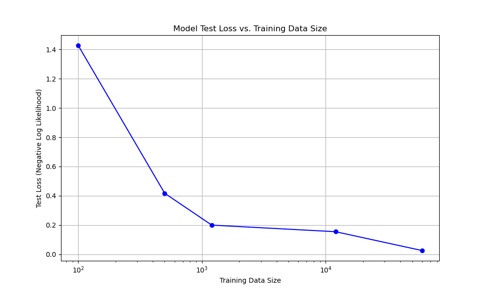

# PyTorch Digit Recognizer

This project is a handwritten digit recognizer built using PyTorch. It utilizes a Convolutional Neural Network (CNN) to classify digits from the MNIST dataset [[1]](#ref-lecun-1998). The project also includes a graphical user interface (GUI) that allows users to draw their own digits and see the model's predictions in real-time.

## Features

- **Convolutional Neural Network (CNN)**: A `Net` class defining the model architecture in `model.py`.
- **Training and Evaluation**: Scripts to train the model on the MNIST dataset and evaluate its performance.
- **Interactive GUI**: A user-friendly interface to draw digits and get predictions from the trained model.
- **Detailed Documentation**: In-depth explanation of the mathematical principles behind the code.
- **Unit and Integration Tests**: A suite of tests to ensure the correctness of the data loading, model, and training functions.

## Documentation Hub

For a complete and detailed overview of the project's architecture, mathematical principles, design rationales, and usage, please refer to the **[Documentation Index](docs/index.md)**.

## Training Performance Analysis



This plot demonstrates how the test loss of the digit recognition model decreases as the size of the training dataset increases [[2]](#ref-bishop-2006). For a detailed explanation of this analysis, including how to interpret loss, please refer to the **[Training Performance Analysis](docs/training_performance.md)** documentation.

## Project Structure

```
├───.gitignore
├───data_loader.py
├───environment.yml
├───model.py
├───train.py
├───gui.py
├───README.md
├───training_performance.png
├───__pycache__/
├───checkpoints/
├───docs/
│   ├───index.md
│   ├───data_loader.md
│   ├───model.md
│   ├───train.md
│   ├───gui.md
│   ├───images/
│   │   └───training_performance.png
│   ├───testing.md
│   └───training_performance.md
├───models/
│   ├───mnist_cnn_subset_1200.pt
│   ├───mnist_cnn_subset_12000.pt
│   └───mnist_cnn_full_dataset.pt
├───test_reports/
│   ├───test_data_loader_report.md
│   ├───test_model_report.md
│   └───test_train_report.md
└───tests/
    ├───test_data_loader.py
    ├───test_model.py
    ├───test_train.py
    └───__pycache__/
```

## Installation

1.  **Clone the repository:**
    ```bash
    git clone https://github.com/kyleyhw/digit_recognition_pytorch.git
    cd digit_recognition_pytorch
    ```

2.  **Create the Conda environment:**
    This project uses a Conda environment to manage dependencies. Create the environment using the provided `environment.yml` file:
    ```bash
    conda env create -f environment.yml
    ```

3.  **Activate the environment:**
    ```bash
    conda activate digit-recognition-pytorch
    ```

## Usage

### Training

The `train.py` script is configured to train on the full dataset by default. You can modify the `main` function in `train.py` to adjust the subset size and number of epochs for custom training runs. The trained model will be saved to the project root and should be moved to the `models/` directory.

```bash
python train.py
```

### Checkpointing

Training progress is automatically saved as checkpoints in the `checkpoints/` directory. This allows for resuming training from the last saved epoch. Checkpoints are named using a `run_id` (e.g., `checkpoint_full_dataset.pt`) to support multiple simultaneous training instances. To resume a specific training run, ensure the `run_id` in the `main` function call matches the desired checkpoint.

### GUI

The GUI is currently configured to use the `mnist_cnn_full_dataset.pt` model for predictions. You can modify the `load_model` function in `gui.py` to switch to a different trained model (e.g., `mnist_cnn_subset_1200.pt` or `mnist_cnn_subset_12000.pt`) if desired.

```bash
python gui.py
```

## Testing


The project includes a comprehensive test suite to ensure the correctness and reliability of the codebase. Tests cover data loading, model architecture, and training/evaluation logic.

To run the test suite, use `pytest`:

```bash
pytest
```

For detailed information on the test suite, including its structure, purpose, and how to interpret test reports, please refer to the **[Testing Documentation](docs/testing.md)**.

## References

1.  <span id="ref-lecun-1998">LeCun, Y., Bottou, L., Bengio, Y., & Haffner, P. (1998). Gradient-based learning applied to document recognition. *Proceedings of the IEEE*, 86(11), 2278-2324. [PDF](http://yann.lecun.com/exdb/publis/pdf/lecun-98.pdf)</span>
2.  <span id="ref-bishop-2006">Bishop, C. M. (2006). *Pattern Recognition and Machine Learning*. Springer. [Amazon](https://www.amazon.com/Pattern-Recognition-Learning-Information-Statistics/dp/0387310738)</span>