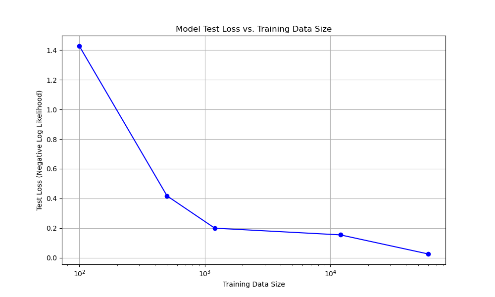

# Training Performance Analysis

This document analyzes the impact of training data size on model performance, using test loss as the primary metric. A plot illustrates this relationship, followed by an explanation of how to interpret the loss values.

## Understanding Loss: Negative Log-Likelihood (NLL) Loss

In machine learning, a **loss function** quantifies the difference between the predicted output of a model and the true target output. The goal of training a model is to minimize this loss.

For multi-class classification problems, such as digit recognition, **Negative Log-Likelihood Loss (NLLLoss)** is commonly used, especially when the model's final layer outputs log-probabilities (e.g., via `log_softmax`).

### Interpretation of NLL Loss:

-   **Lower is Better**: A smaller NLL loss value indicates that the model's predicted probability distribution is closer to the true probability distribution (i.e., the model is more confident and accurate in its predictions). Conversely, a higher loss means the model is performing poorly.
-   **Probability-Based**: NLL loss inherently works with probabilities. If the model assigns a high probability to the correct class, the negative logarithm of that probability will be a small positive number (close to zero). If it assigns a low probability to the correct class, the loss will be a large positive number.
-   **Penalizes Wrong Confidences**: It heavily penalizes models that are confident in incorrect predictions.

A loss of 0 would mean the model predicts the correct class with 100% certainty every time.

## Impact of Training Data Size on Test Loss

The following plot demonstrates how the test loss of the digit recognition model decreases as the size of the training dataset increases. This visually confirms the principle that models generally learn more robust and accurate representations when exposed to more data.

### Discussion of Results

As observed in the plot, the test loss consistently decreases as the training data size increases from 1,200 to 12,000, and further to the full dataset of 60,000 images. This indicates that providing the model with more diverse examples during training helps it to generalize better to unseen data, resulting in more accurate predictions and a lower error rate.

Specifically:
-   Training on a very small subset (e.g., 1,200 images) results in a relatively high test loss, suggesting the model has not learned enough to generalize well.
-   Increasing the data size to 12,000 images leads to a significant drop in test loss, showing substantial improvement in performance.
-   Utilizing the full dataset (60,000 images) yields the lowest test loss, re-confirming that for most machine learning tasks, more data often leads to better model performance, assuming the data is of good quality and relevant.

Each model was evaluated on the **full MNIST test set** (10,000 images) to provide a consistent and fair comparison of their generalization capabilities.